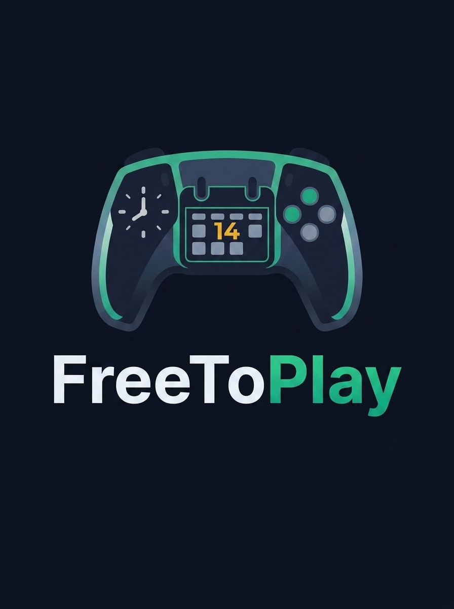

<p align="center">
  
</p>

<p align="center">
  <strong>Schedule gaming sessions with friends — web dashboard + Discord bot.</strong>
</p>

<p align="center">
  <a href="https://github.com/mckenna654/FreeToPlay/releases"></a>
  <a href="LICENSE"></a>
  
  
</p>

---

## About

**FreeToPlay** is a self-hosted web app and Discord bot for adult gaming groups who struggle to line up schedules.

Log in with Discord, pick a game, set a time, and let friends RSVP from the web calendar **or** straight from Discord. When someone creates or cancels a session, the bot keeps your channel in sync automatically.

Ideal for Unraid, Docker, Portainer, or any home server — with optional HTTPS via Nginx Proxy Manager.

---

## Features

### Web dashboard
- **Ultra-dark SaaS UI** — slate/zinc theme, rounded cards, emerald accents
- **Monthly calendar** — sessions appear on the correct day with time + title
- **Sidebar widgets** — upcoming sessions and active members
- **Event detail pages** — cover art banner, description, host info
- **RSVP statuses** — Confirmed (teal), Tentative (amber), Declined (rose)
- **Capacity tracking** — max players + live progress bar (e.g. 3/4 filled)
- **Host controls** — creators can cancel/delete their own events
- **Discord login** — Passport OAuth2, no separate accounts

### Game search & art
- **RAWG API autocomplete** — type a game name, pick from live results
- **Cover art** — pulled automatically onto the dashboard and Discord embeds
- Works without an API key (manual game names still work)

### Discord bot
- **Rich embeds** on new sessions (title, game, time, slots, host, cover art)
- **Interactive buttons** — Join / Tentative / Decline (syncs to the database)
- **Web Dashboard button** — opens your calendar so others can host too
- **Clickable event title** — links to that session’s web page
- **Cancellation sync** — deletes the original embed and posts a cancel notice

### Deploy & ops
- **Docker / GHCR image** — `ghcr.io/mckenna654/freetoplay:latest`
- **SQLite + Prisma** — simple single-file DB on a volume
- **Reverse proxy ready** — trust proxy + secure cookies for HTTPS domains
- **MIT licensed**

---

## Quick start (Docker / Unraid)

**Image:** `ghcr.io/mckenna654/freetoplay:latest`

| Setting | Value |
|--------|--------|
| Network | Bridge |
| Port | `3000` → `3000` |
| Path | Host `/mnt/user/appdata/freetoplay/data/` → Container `/app/data` |

### Environment variables

| Variable | Required | Description |
|----------|----------|-------------|
| `DISCORD_CLIENT_ID` | Yes | Discord application client ID |
| `DISCORD_CLIENT_SECRET` | Yes | Discord application client secret |
| `DISCORD_BOT_TOKEN` | Yes | Bot token |
| `DISCORD_CHANNEL_ID` | Yes | Channel ID for session posts |
| `BASE_URL` | Yes | Public URL, e.g. `https://f2p.example.com` or `http://192.168.1.50:3000` |
| `SESSION_SECRET` | Yes | Random string for login cookies |
| `DATABASE_URL` | Yes | Must be `file:/app/data/prod.db` |
| `RAWG_API_KEY` | No | Free key from [rawg.io](https://rawg.io/apidocs) for game search/art |
| `PORT` | No | Defaults to `3000` |

---

## Discord setup

1. Create an app in the [Discord Developer Portal](https://discord.com/developers/applications).
2. **OAuth2 → Redirects:** add  
   `{BASE_URL}/auth/discord/callback`  
   Example: `https://f2p.example.com/auth/discord/callback`
3. Create a **Bot**, copy the token, enable message/embed permissions.
4. Invite the bot with the `bot` scope (Send Messages, Embed Links, View Channels).
5. Enable **Developer Mode** in Discord → right-click your channel → **Copy Channel ID**.

---

## RAWG game database (optional)

1. Sign up at [rawg.io/apidocs](https://rawg.io/apidocs) and create an API key.
2. Set `RAWG_API_KEY` on the container and restart.
3. On **Schedule Session**, type 3+ letters in **Game Name** for autocomplete + cover art.

---

## External hosting (Nginx Proxy Manager)

1. Set `BASE_URL` to your HTTPS domain, e.g. `https://f2p.example.com`.
2. Add the same domain callback in Discord OAuth2 redirects.
3. In NPM, add a Proxy Host:
   - **Domain:** `f2p.example.com`
   - **Forward to:** your server IP, port `3000`
   - **SSL:** Let’s Encrypt + Force SSL
   - Enable Websockets if available

---

## Local development

```bash
git clone https://github.com/mckenna654/FreeToPlay.git
cd FreeToPlay
cp .env.example .env   # fill in Discord + secrets
npm install
npx prisma migrate dev
npm run dev
```

Open `http://localhost:3000`.

---

## Stack

- **Node.js** + **Express** + **EJS**
- **Prisma** + **SQLite**
- **discord.js**
- **Passport Discord OAuth**
- **Tailwind CSS**
- **Docker** (multi-stage Alpine image)

---

## License

[MIT](LICENSE) © mckenna654
