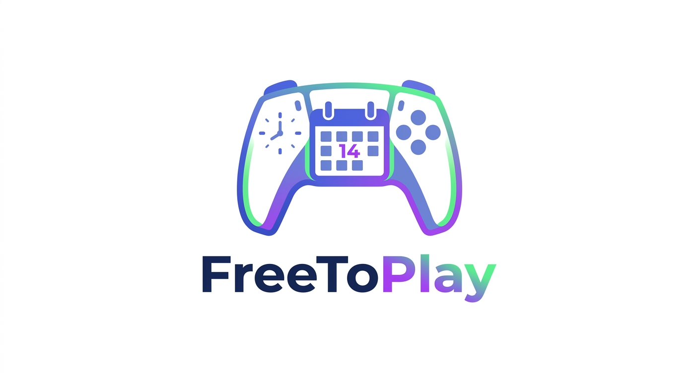

<p align="center">
  
</p>

<p align="center">
  <strong>The Ultimate Gaming Session Scheduler for Discord Communities.</strong>
</p>

<p align="center">
  
  
</p>

---

## 📖 About FreeToPlay

**FreeToPlay** is a modern, self-hosted web application and Discord Bot designed to solve the hardest part of being an adult gamer: *scheduling time to play with your friends.*

Built with a slick, dark-mode dashboard inspired by modern SaaS apps, FreeToPlay allows users to log in via Discord, schedule upcoming game sessions, and instantly RSVP. 

Whenever a session is created, the built-in Discord bot automatically posts a rich embed into your server with **Interactive Buttons**, allowing your squad to RSVP (`Join`, `Tentative`, `Decline`) directly from the Discord chat!

## ✨ Features

- 🎨 **Modern SaaS UI:** Ultra-dark dashboard with a full monthly calendar grid and dedicated event pages.
- 🔐 **Discord Authentication:** Zero friction. Log in securely using your existing Discord account.
- 🎮 **RAWG Game Database API:** Autocomplete search for games, automatically pulling in stunning high-res cover art for your dashboard.
- 🤖 **Interactive Discord Bot:** Posts beautiful game announcements with actionable RSVP buttons that sync live with the web database.
- 🗑️ **Host Controls & Sync:** Hosts can cleanly cancel events, which automatically deletes the original Discord embed and posts a cancellation notice.
- 🐳 **Fully Containerized:** Easy to deploy on Unraid, Portainer, or any standard Docker-capable server.

## 🚀 Getting Started (Docker / Unraid)

FreeToPlay is published as a Docker image to the GitHub Container Registry. 

### Unraid Setup
1. In Unraid, go to the **Docker** tab and click **Add Container**.
2. **Repository:** `ghcr.io/mckenna654/freetoplay:latest`
3. **Network:** `Bridge`
4. Add a **Port**: Container Port `3000` -> Host Port `3000` (or your preferred port).
5. Add a **Path** (Crucial for database persistence):
   - Container Path: `/app/data`
   - Host Path: `/mnt/user/appdata/freetoplay/data/`
6. Add the following **Environment Variables** (see below).

### Environment Variables

| Variable | Description |
|----------|-------------|
| `DISCORD_CLIENT_ID` | Your Discord App Client ID |
| `DISCORD_CLIENT_SECRET` | Your Discord App Client Secret |
| `DISCORD_BOT_TOKEN` | Your Discord Bot Token |
| `DISCORD_CHANNEL_ID` | The ID of the Discord text channel where the bot should post |
| `BASE_URL` | Your public URL or local IP (e.g., `http://192.168.1.50:3000`) |
| `SESSION_SECRET` | A random string used to secure login sessions |
| `DATABASE_URL` | **MUST BE:** `file:/app/data/prod.db` |
| `RAWG_API_KEY` | *(Optional)* Free API key from rawg.io for game cover art |

---

## 🎮 How to enable the Game Database (RAWG API)
To get automatic game cover art and autocomplete search working when scheduling a session:
1. Create a free account at [RAWG.io](https://rawg.io/apidocs).
2. Generate an API Key in your developer dashboard.
3. Add the `RAWG_API_KEY` environment variable to your Docker container with your key.
4. Restart the container. Start typing a game name, and the magic happens!

## 🤖 Discord Bot Setup
1. Create an application in the [Discord Developer Portal](https://discord.com/developers/applications).
2. Under **OAuth2 -> Redirects**, add your callback URL: `http://<YOUR_BASE_URL>/auth/discord/callback`.
3. Under **Bot**, generate a token. Ensure it has permissions to send messages and embed links.
4. Use the OAuth2 URL Generator to invite the bot to your server with the `bot` scope.

## 🛠️ Development

To run the project locally without Docker:
```bash
npm install
npx prisma migrate dev
npm run dev
```

## 📝 License

ISC License
